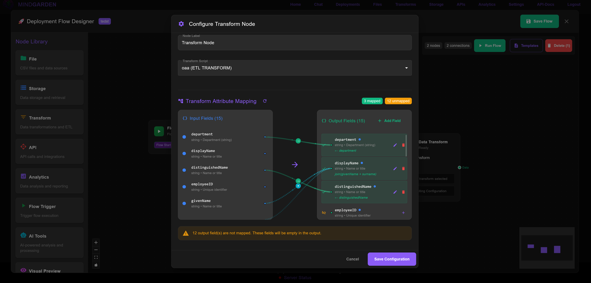
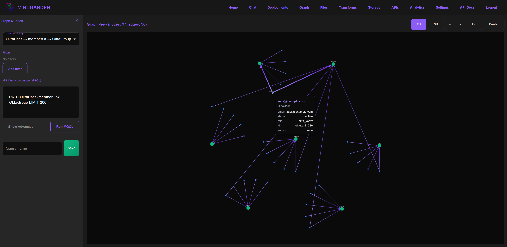
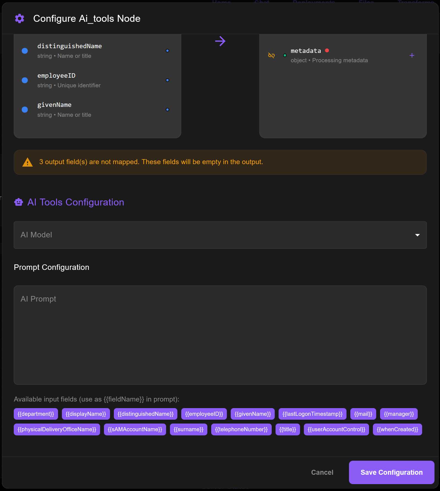
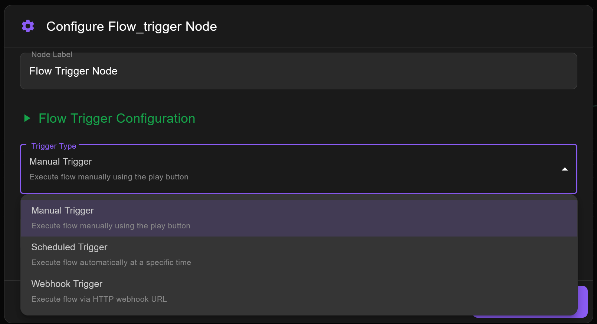

# MindGarden Platform (Open Source)

MindGarden is a enterprise grade data orchestration and integration platform with a visual web client, an API server, and optional AI-core services. It lets you build flows connecting files, transforms, APIs, analytics, and storage, with Auth0-secured access and optional graph/DB backends. All core services are orchestrated with Docker Compose. On top of the core platform, domain-specific “Workloads” can be enabled via feature flags — the first workload suported is NeuroTech (EEG devices + experiments).

## Screenshots









## Quickstart (local)

1) Prerequisites
- Docker Desktop with Compose (Windows/macOS/Linux)
- Node.js 18+ and npm
- An Auth0 tenant (free OK)

2) Clone
```bash
git clone https://github.com/mindgardenai/mindgardenai-platform-dev.git
cd mindgardenai-platform-dev
```

3) Create environment file
- Copy the example to `.env` (same directory as `docker-compose.yml`).
  - Windows (PowerShell):
    ```powershell
    Copy-Item env.example .env
    ```
  - macOS/Linux (bash):
    ```bash
    cp env.example .env
    ```

4) Fill `.env` with required values
- Web-Client (Next.js):
  - NEXT_PUBLIC_API_SERVER_URL=http://localhost:5000
  - NEXT_PUBLIC_AUTH0_DOMAIN=your-tenant.auth0.com
  - NEXT_PUBLIC_AUTH0_CLIENT_ID=YOUR_APP_CLIENT_ID
  - NEXT_PUBLIC_AUTH0_API_IDENTIFIER=https://mindgarden.local/api (or your chosen identifier)
  - NEXT_PUBLIC_AUTH0_CALLBACK_URL=http://localhost:3000/callback
  - NEXT_PUBLIC_ENABLE_RBAC=false (set true if you will configure RBAC permissions)
- Server (Flask):
  - FLASK_SECRET_KEY=some-random-string
  - CLIENT_ORIGIN=http://localhost:3000
  - AUTH0_DOMAIN=your-tenant.auth0.com
  - AUTH0_CLIENT_ID=YOUR_APP_CLIENT_ID
  - AUTH0_CLIENT_SECRET=YOUR_APP_CLIENT_SECRET
  - AUTH0_REDIRECT_URI=http://localhost:3000/callback
  - AUTH0_API_IDENTIFIER=same as NEXT_PUBLIC_AUTH0_API_IDENTIFIER
  - AUTH0_MGMT_CLIENT_ID=YOUR_M2M_CLIENT_ID (Auth0 Management API app)
  - AUTH0_MGMT_CLIENT_SECRET=YOUR_M2M_CLIENT_SECRET
  - FLASK_SESSION_TYPE=redis
  - FLASK_SESSION_REDIS_URL=redis://redis:6379/0
- Datastores:
  - NEO4J_AUTH=neo4j/password
  - PG_USER=mguser, PG_PASSWORD=mgpass, PG_DB=mgdb

5) Configure Auth0 (one-time)
- Create a Regular Web Application
  - Allowed Callback URLs: `http://localhost:3000/callback`
  - Allowed Web Origins: `http://localhost:3000`
  - Allowed Logout URLs: `http://localhost:3000`
  - Copy Client ID/Secret into `.env` (both NEXT_PUBLIC_ and server vars)
- Create an API
  - Identifier: `https://mindgarden.local/api` (or your own), RS256
  - If enabling RBAC: add permissions like `transforms:get`, `devices:get`, etc. (see `server/services/auth.py` ALL_PERMISSIONS)
- Create a Machine-to-Machine app for the Auth0 Management API
  - Authorize to Management API with appropriate scopes (e.g., read:users, delete:users_sessions)
  - Put its Client ID/Secret in `.env` (AUTH0_MGMT_*)

6) Start the stack
```bash
docker docker-compose -f docker-compose.yml build
docker-compose -f docker-compose.yml up -d 
```
- Keep it attached for logs, or add `-d` to run in background.

```bash
docker-compose -f docker-compose.dev.yml logs -f
```

7) Verify services
- Server health: open `http://localhost:5000/api/health` → expect JSON `{ "status": "healthy", ... }`
- Web-Client: open `http://localhost:3000` → click “Login” and complete Auth0
- API Docs: open the API Docs page in the Web-Client (left nav) → it should show server OpenAPI with correct URL

8) First log in
- After Auth0 login and redirect to `/callback`, an `access_token` cookie is set.
- You should land on `/` and see main navigation.

9) Optional: RBAC
- If `NEXT_PUBLIC_ENABLE_RBAC=true`, ensure your Auth0 user has the needed permissions for pages you’ll use (e.g., `transforms:get`, `files:get`). Otherwise you’ll see unauthorized messages. For local use, it is suggested to disable RBAC with  `NEXT_PUBLIC_ENABLE_RBAC=false`

10) Optional: enable NeuroTech workload
- In Web-Client, go to Settings → Feature Flags → enable “NeuroTech Workloads”.
- This adds Devices and Experiments pages and MGFlow nodes.
- Streaming requires the Universal Agent (see `web-client/docs/NEUROTECH_WORKLOADS.md`).

Troubleshooting (common)
- 401/invalid token: double-check `AUTH0_DOMAIN`, callback URL, and that tokens are issued for the correct app/API.
- Callback page loops: ensure `NEXT_PUBLIC_AUTH0_CALLBACK_URL` and `AUTH0_REDIRECT_URI` match and are in Auth0 Allowed Callback URLs.
- Session errors: ensure `FLASK_SECRET_KEY` is populated, `FLASK_SESSION_TYPE=redis`, and Redis container is healthy.
## 1) Overview

Main parts (containers):
- Web-Client: Next.js app at http://localhost:3000
- Server: Flask API at http://localhost:5000
- Datastores: Neo4j, Postgres, Redis
- Optional AI-Core: Open WebUI/Ollama stack under `ai-core/` (separate compose)

Screenshots and demos are under `screenshots/`.

Key capabilities (Core Platform):
- Flow designer for File → Transform → API/Analytics → Storage
- API connections with test window and OpenAPI support
- Attribute mapping and schema detection (see `web-client/docs/ATTRIBUTE_MAPPING_GUIDE.md`)
- RBAC-ready endpoints using Auth0 permissions
- Real-time updates via WebSocket

Workloads:
- NeuroTech (optional): Devices and Experiments pages, MGFlow nodes for device streaming and experiments, and integration with the Universal Agent for EEG streaming.

## 2) Run locally (step-by-step)

Prerequisites:
- Docker Desktop (Engine + Compose) on Windows/Mac/Linux
- Node.js 18+ and npm (for local Next.js builds)
- Python 3.11+ (only if building server image locally; container includes Python)
- Auth0 tenant (for auth) — required

Environment variables
- Create a `.env` at repo root (Compose reads from it). You can copy `.env.example` and edit.

Web-Client (Next.js):
- NEXT_PUBLIC_API_SERVER_URL: http://localhost:5000
- NEXT_PUBLIC_AUTH0_DOMAIN: your-tenant.auth0.com
- NEXT_PUBLIC_AUTH0_CLIENT_ID: from Auth0 App
- NEXT_PUBLIC_AUTH0_API_IDENTIFIER: your API identifier string
- NEXT_PUBLIC_AUTH0_CALLBACK_URL: http://localhost:3000/callback
- NEXT_PUBLIC_ENABLE_RBAC: true or false
- NEXT_PUBLIC_SUPER_ADMIN_ROLES: optional comma list (default: mindgardenai-admin)
- NEXT_PUBLIC_COOKIE_DOMAIN: leave empty for localhost

Server (Flask):
- FLASK_SECRET_KEY: any random string
- CLIENT_ORIGIN: http://localhost:3000
- MODE: dev
- AUTH0_DOMAIN: your-tenant.auth0.com
- AUTH0_CLIENT_ID: from Auth0 App
- AUTH0_CLIENT_SECRET: from Auth0 App
- AUTH0_REDIRECT_URI: http://localhost:3000/callback
- AUTH0_API_IDENTIFIER: your API identifier string (see Auth0 setup)
- AUTH0_MGMT_CLIENT_ID: from Auth0 M2M app (Management API)
- AUTH0_MGMT_CLIENT_SECRET: from Auth0 M2M app
- ENABLE_RBAC: true or false
- FLASK_SESSION_TYPE: redis
- FLASK_SESSION_REDIS_URL: redis://redis:6379/0
- PG_USER, PG_PASSWORD, PG_DB: e.g., mguser, mgpass, mgdb
- NEO4J_URI, NEO4J_USER, NEO4J_PASSWORD (if used by server routes)

Neo4j/Postgres/Redis:
- NEO4J_AUTH: neo4j/password
- PG_USER, PG_PASSWORD, PG_DB as above

AI-Core (optional): see `ai-core/docs/README-Docker-Compose.md` and `ai-core/docs/AUTH0_INTEGRATION.md`.

Auth0 configuration
1. Create an Auth0 “Regular Web Application”
   - Allowed Callback URLs: http://localhost:3000/callback
   - Allowed Web Origins: http://localhost:3000
   - Allowed Logout URLs: http://localhost:3000
   - Client ID/Secret → set as AUTH0_CLIENT_ID/SECRET and NEXT_PUBLIC_AUTH0_CLIENT_ID
2. Create an Auth0 API (for RBAC/permissions)
   - Identifier: choose a stable URL-like string (e.g., https://mindgarden.local/api)
   - Signing algorithm: RS256
   - If using RBAC: define permissions matching server namespaces (e.g., devices:get, transforms:post). See `server/services/auth.py` `ALL_PERMISSIONS` for reference.
3. Create a Machine-to-Machine application for the Management API
   - Authorize it to Auth0 Management API (read:users, delete:users_sessions, etc.)
   - Use its credentials for AUTH0_MGMT_CLIENT_ID/SECRET

Local login flow
- The web-client builds an Auth0 authorize URL and sends users to Auth0.
- Auth0 redirects back to http://localhost:3000/callback with a code.
- The web-client calls the server `/api/callback` to exchange code for tokens.
- The server validates tokens (JWKS) and stores a user object in session; the client stores `access_token` as a cookie and sends it on API calls.

Install and run
1. Copy `.env.example` to `.env` and fill values as noted above.
2. Start Docker services from repo root:
   - Build and run: `docker compose up --build`
   - This starts: `web-client` on 3000, `server` on 5000, `neo4j` on 7474/7687, `postgres` on 5432, `redis` on 6379.
3. Open http://localhost:3000 and click “Login”.
4. After login, the app will route back to `/` and use the cookie to access APIs.

First-run checklist
- Verify http://localhost:5000/api/health returns healthy
- In Web-Client Settings, confirm `NEXT_PUBLIC_API_SERVER_URL` renders correctly in API Docs
- If using RBAC, ensure your user has necessary permissions in Auth0 for pages you’ll visit (e.g., `transforms:get`, `devices:get`)

OS notes
- Windows/macOS/Linux: steps are the same with Docker Desktop. Ensure ports 3000/5000/5432/6379/7474/7687 are free.
- For SSL domains and cookies, keep NEXT_PUBLIC_COOKIE_DOMAIN empty on localhost.

Common issues
- 401 Unauthorized: verify `AUTH0_DOMAIN`, callback URL, and that tokens are issued for your app. Ensure RBAC permission grants if ENABLE_RBAC=true.
- Callback fails: ensure `/api/callback` is reachable from web-client and the code is present in the callback URL.
- Session errors: set `FLASK_SECRET_KEY` and `FLASK_SESSION_TYPE=redis` with Redis running.

## 3) Workloads and Feature Flags

Concept
- The Core Platform is always available (files, transforms, APIs, storage, analytics, graph).
- Workloads are optional domain layers you can enable per-user via feature flags (stored server-side and mirrored in localStorage for UX).

NeuroTech Workloads
- What it adds: Devices page, Experiments page, MGFlow nodes for devices/experiments, real-time EEG streaming via Universal Agent.
- Enable/disable: Web-Client → Settings → Feature Flags → “NeuroTech Workloads”.
- Persistence: `/api/user/settings` (see `server/services/user_settings.py`), mirrored in `localStorage` as `feature_neuroTechWorkloads`.
- Docs: `web-client/docs/NEUROTECH_WORKLOADS.md`.

Add a new workload (pattern)
- Web-Client: add pages/components and hide/show them behind a new feature flag key in `user.settings.featureFlags`.
- Server: expose routes and permission names following the `{namespace}:{method}` pattern; add to Auth0 as needed.
- RBAC: if using RBAC, define permissions for the new namespace and grant to your roles in Auth0.
- Settings: store defaults in `server/services/user_settings.py` similar to `neuroTechWorkloads`.

Universal Agent (NeuroTech)
- Purpose: runs on a Pi/hub, authenticates via Auth0, registers devices via `/api/devices`, and exposes a WebSocket for streaming and control.
- Setup: see `universal-agent/README.md` and the quick steps in `web-client/docs/NEUROTECH_WORKLOADS.md`.

## 4) Contributing

This project is in active development. Some features are rough or incomplete, others are production-ready. Join us! We would be honored to have you join the project. We welcome issues, discussions, and PRs. 

Guidelines:
- Fork and create feature branches; submit PRs against `main`.
- Add tests or thorough manual test steps where relevant.
- Keep edits focused and small; include screenshots for UI changes.
- Follow existing code style and naming; prefer explicit, readable code.

Areas to help:
- Docs: onboarding, Auth0 setup clarifications, examples
- Connectors: new APIs, storage backends, and transforms
- RBAC: permission coverage and automation of permission derivation from routes
- DX: dev containers, sample data, demo flows

## Docs
- `web-client/docs/ATTRIBUTE_MAPPING_GUIDE.md`
- `web-client/docs/CONNECTOR_SYSTEM_GUIDE.md`
- `web-client/docs/NEUROTECH_WORKLOADS.md`
- `server/docs/`
- `ai-core/docs/README-Docker-Compose.md`
- `ai-core/docs/AUTH0_INTEGRATION.md`

## License

Licensed under the GNU Affero General Public License v3.0 (AGPL-3.0). See `LICENSE`.